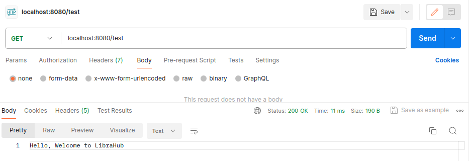

# LIBRARY-DATABASE-MANAGEMENT-SYSTEM
This is a backend project made on Spring Boot framework. This can help in managing database for school library.

## Features of this Application

**Containerization of the Application:** <br> *Containerized this application for seamless deployment anywhere, be it cloud or your local server etc.*

**CI/CD on AWS:** <br> *Utilized AWS CodePipeline (CodeCommit, CodeBuild and CodeDeploy) for deploying this backend application on AWS*

_________________________________________________
# Table of Contents
_________________________________________________

- [Instructions for Running this Project on your Computer](#Instructions-for-Running-this-Project-on-your-Computer)
    * [Prerequisites](#Prerequisites)
    * [How to Run](#how-to-run)
    * [Additional Notes](#additional-notes)
- [Design of the Application](#design-of-the-application)
- [Database Schema (EER Diagram)](#Database-Schema-eer-diagram))
- [CI/CD Setup Diagram on AWS](#CICD-Setup-Diagram-on-AWS)
- [API Description](#API-Description)
- [Tech Stack](#Tech-Stack)

_________________________________________________
# Instructions for Running this Project on your Computer
_________________________________________________

## Prerequisites

Make sure you have the following tools installed on your machine:

- [Docker](https://docs.docker.com/get-docker/)
- [Docker Compose](https://docs.docker.com/compose/install/)
- [JDK 17 or higher](https://www.oracle.com/java/technologies/downloads/#java17)
- [Maven 3.2.0](https://maven.apache.org/install.html)

## How to Run

1. Clone the repository to your local machine:

    ```bash
    git clone https://github.com/PranshuBarar/LibraHub.git
    ```

2. Navigate to the project directory:

    ```bash
    cd <respository_name_here>
    ```

3. Run Docker Containers of MySQL and Spring Boot Application:

   ```bash
    docker build -t librahub .
    ```

   ```bash
    docker compose up
    ```

4. You can visit [http://localhost:8080/test](http://localhost:8080/test) to see that application is running
  You will see this message:
  

## Additional Notes

- If you encounter any issues, ensure that ports 8080 and 3306 are available on your machine.

- Customize your application configuration in the `application.properties` files if you require doing so.

- You are most welcome to explore other available endpoints and functionalities as documented in the project.


_________________________________________________
# Design of the Application
_________________________________________________
<br>
<br>


_________________________________________________
# Database Schema (EER Diagram)
_________________________________________________
To be added soon

_________________________________________________
# CI/CD Setup Diagram on AWS
_________________________________________________
To be added soon

_________________________________________________
# API Description
_________________________________________________

## StudentController

* Add a new student (Card for him/her will be generated automatically)


* Get the name of the student using his/her email address


* Update the mobile number of student


## AuthorController

* Add a new author


## BookController

* Add a new Book for an author using his/her ID


## TransactionController

*Issue the book on a valid card using bookId and cardId 


_________________________________________________
# Tech Stack
_________________________________________________
This project uses the following tech stack:
* [Spring Boot](https://spring.io/projects/spring-boot)
* [Hibernate](https://hibernate.org/)
* [MySQL](https://www.mysql.com/) (For Database)
* [Docker for Containerization](https://www.docker.com/)